# Pmato植物园激励式学习软件 V1.0 用户手册

编写日期：2026 年 10 月 1 日

---

## 目录

- 第 1 章　软件简介
- 第 2 章　安装与启动
- 第 3 章　专注学习计时
- 第 4 章　植物园养成
- 第 5 章　待办清单
- 第 6 章　日程规划
- 第 7 章　数据统计
- 第 8 章　系统与设置
- 附录　学习助手

---

# 第 1 章　软件简介

## 1.1 这款软件要解决什么问题

很多同学都有过这样的经历：坐下来准备学习，先刷了十分钟手机；好不容易进入状态，又被一条消息打断；等到晚上回想，发现一天下来真正专注的时间少得可怜。

番茄工作法是应对这个问题的经典方法——专注二十多分钟，然后休息几分钟，如此循环。市面上已经有不少番茄钟应用，但它们大多只提供一个倒计时。倒计时结束，"叮"一声，然后呢？没有然后了。用户坚持三五天，新鲜感一过就不再打开。

问题出在反馈上。倒计时是一个纯粹的数字，它减少的过程不会给用户带来任何积累感。今天专注了四个番茄，和昨天专注了三个，除了数字不同，感受上没有任何区别。

## 1.2 核心设计：把学习时长变成植物

Pmato 的做法是把抽象的专注时长，转换成看得见的植物生长。

每完成一次专注，你就获得一定数量的能量。这些能量可以拿去浇灌植物园里的作物。作物会随着能量累积，从种子一路长成幼苗、抽枝、花苞，直到成熟。成熟之后可以收获，收进图鉴，同时解锁新的作物品种。

这样一来，"今天专注了四个番茄"这件事，不再只是一个数字，而是植物园里实实在在多出来的几株作物。学习投入变成了可以看见的积累，坚持的动力也就从"完成任务"变成了"养大这株花"。

软件的名称 Pmato，取自番茄的英文 tomato 与专注的谐音组合。

## 1.3 软件包含哪些功能

软件共六个主模块，另有一个学习助手：

| 模块 | 作用 |
| --- | --- |
| F1 专注学习 | 番茄钟计时，支持暂停、放弃与休息循环 |
| F2 植物园 | 消耗能量种植作物，观察生长，收获收集 |
| F3 待办清单 | 记录学习任务，设定优先级与预计番茄数 |
| F4 日程规划 | 以周视图安排时间段，设置到点提醒 |
| F5 数据统计 | 查看专注时长趋势、番茄数量与收集进度 |
| F6 系统与设置 | 调整计时时长、免打扰、外观主题与数据备份 |
| 学习助手 | 调用人工智能接口，辅助拆解任务与规划安排 |

六个模块不是彼此孤立的。在待办里选一个任务开始专注，专注产生的能量会流进植物园，番茄进度会记回待办；专注记录又会汇总到统计页。这条链路是这款软件的主要使用路径，第 5 章和第 4 章会详细说明。

## 1.4 运行环境

软件在 Windows 系统上运行，具体环境要求见下一章。数据全部保存在本机的一个数据库文件里，不联网也能使用全部功能——只有学习助手需要连接网络。

---

# 第 2 章　安装与启动

## 2.1 环境要求

| 项目 | 要求 |
| --- | --- |
| 操作系统 | Windows 10 或 Windows 11 |
| 内存 | 4GB 以上 |
| 磁盘空间 | 500MB 以上 |
| Java 运行环境 | JDK 17 或更高版本（若使用集成了运行时的安装包，则无需单独安装） |
| 网络 | 仅学习助手功能需要 |

## 2.2 启动软件

如果拿到的是免安装版本，解压后双击目录中的启动程序即可。

如果拿到的是源码工程，在工程根目录执行：

```
mvn javafx:run
```

首次运行需要从网络下载依赖，视网速可能需要几分钟。之后再启动就很快了。
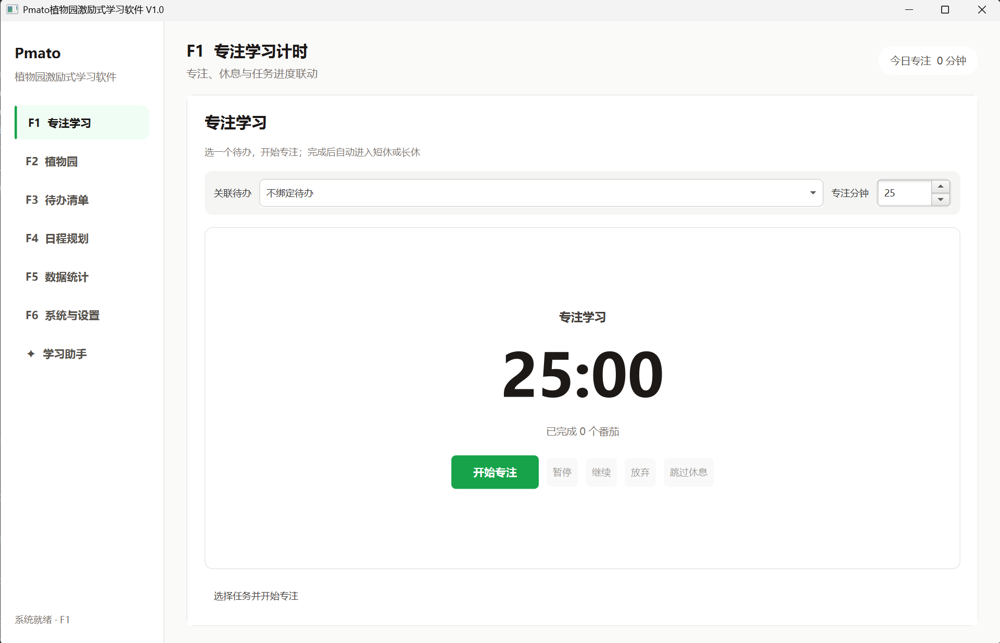
【图 2-1：启动后的主界面】

## 2.3 首次启动会看到什么

第一次打开软件时，数据库是空的。程序会自动完成两件准备工作：一是建立数据表结构，二是把八种内置作物写进图鉴。这个过程是自动的，不需要你操作。

启动后默认停在植物园页面。因为还没有任何专注记录，此时能量为零，图鉴里只有五种普通作物可以种植。这是正常现象——先去专注，能量才会来。
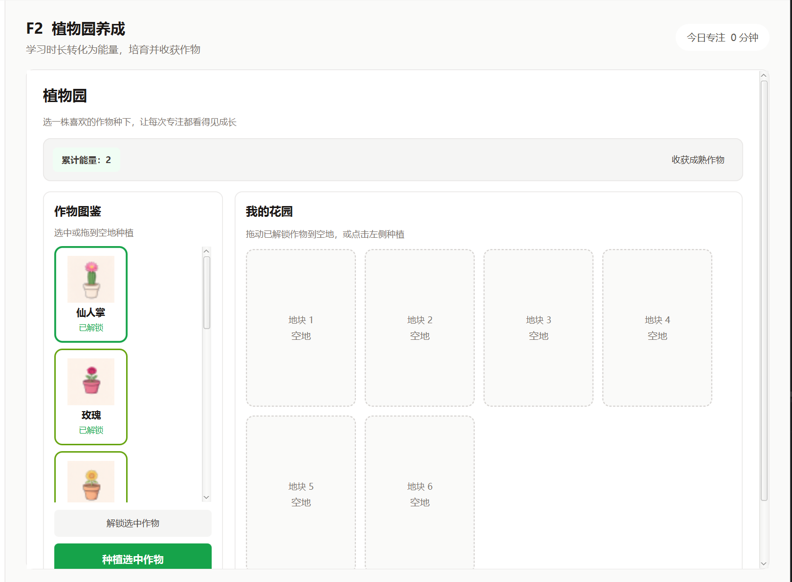
【图 2-2：首次启动的植物园页面】

## 2.4 界面布局

主界面分为左右两块。

**左侧是导航栏**，纵向排列七个入口：专注学习、植物园、待办清单、日程规划、数据统计、系统与设置，最后是学习助手。点击任意一项，右侧内容区就会切换到对应页面。

导航栏顶部显示软件名称，底部显示当前状态和今日已专注的分钟数。这个数字会随着你完成专注实时更新，不用切换页面就能看到今天的进度。
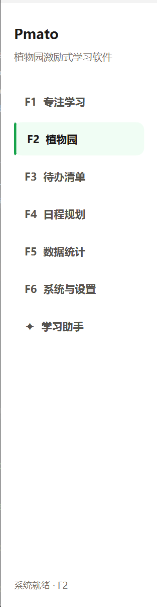

【图 2-3：左侧导航栏】

**右侧是内容区**，显示当前所选模块。每个页面顶部都有标题和一句说明，告诉你这个页面是做什么的。

页面切换不会中断正在进行的计时。你可以放心地在专注过程中切到待办页去加一个任务，再切回来，倒计时一直在正常走。

## 2.5 关闭窗口与系统托盘

软件支持系统托盘常驻。

点击窗口右上角的关闭按钮，程序不会退出，而是收进屏幕右下角的托盘区。托盘图标是一个绿色圆形底、中间有一株白色幼苗的图案。之所以这样设计，是因为番茄钟经常需要在你做别的事情时在后台走完，如果关掉窗口程序就退出，计时就白费了。

用鼠标左键单击托盘图标，主窗口会重新显示到前台。

在托盘图标上点右键，会弹出三个菜单项：

- **显示主窗口**——与左键单击效果相同
- **开始专注**——直接切回专注页面
- **退出**——真正结束程序

只有选择"退出"，程序才会关闭。另外，关闭窗口时如果主窗口不在前台，托盘会弹出一条气泡提示，告诉你程序已经最小化到托盘了。


【图 2-4：托盘图标与右键菜单】

> 注：如果你的系统环境不支持系统托盘（例如某些精简版系统或远程桌面环境），软件会自动改为"关闭即退出"的普通行为，不会出现点了关闭却退不出去的情况。

## 2.6 常见问题

**问：双击程序没有反应怎么办？**

先确认是否已安装 JDK 17 或更高版本。可以在命令行执行 `java -version` 查看。如果提示找不到命令，说明需要先安装 Java 运行环境。

**问：窗口标题显示的版本号和对不上？**

窗口标题会显示完整的软件名称与版本号。这是为了让软件版本一目了然，属于正常现象。

**问：数据库文件在哪里？**

数据库文件位于程序运行目录下，名为 `mengya.db`。这是软件的全部数据——专注记录、待办、日程、植物园状态都在里面。备份它就是备份全部数据，具体操作见第 8 章。

---

# 第 3 章　专注学习计时

## 3.1 关于番茄工作法

番茄工作法的基本做法是：设定一个固定的专注时长（传统上是 25 分钟），在这段时间里只做一件事；时间到了就休息几分钟；休息完再进入下一个专注。如此重复若干轮之后，进行一次较长的休息。

这套方法的关键在于"固定的时长"和"强制的休息"。时长固定，能让大脑快速进入状态；强制休息，能避免长时间连续工作导致的效率衰减。

Pmato 完整实现了这套循环，并允许你调整每一段的具体长度。

## 3.2 开始一次专注

进入专注页面，你会看到：

- 页面中央是当前计时状态和剩余时间
- 上方有一个下拉框，用来选择本次专注要绑定的待办任务
- 旁边是时长设置框，默认 25 分钟
- 下方是一排操作按钮

操作步骤：

1. （可选）在任务下拉框里选择一个待办任务。如果暂时不想关联任务，保持"不绑定待办"即可。
2. 确认时长。默认 25 分钟，可以直接在设置框里改，范围是 1 到 180 分钟。
3. 点击"开始专注"。

计时开始后，剩余时间会逐秒递减，页面进入专注状态。此时任务下拉框和时长设置框会变为不可用，防止专注途中误改。

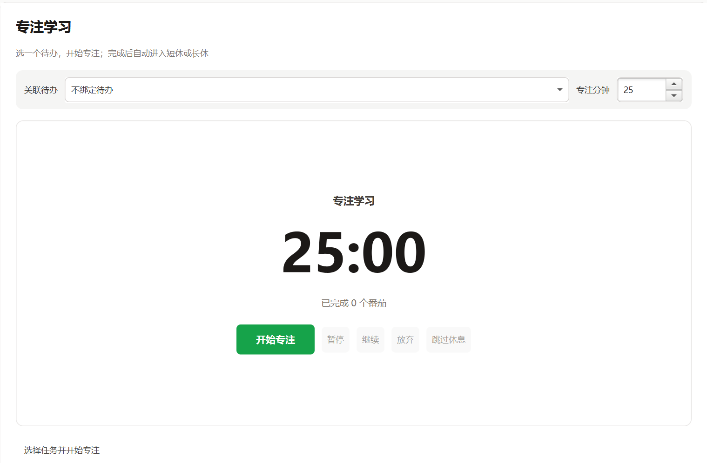
【图 3-1：专注页面初始状态】
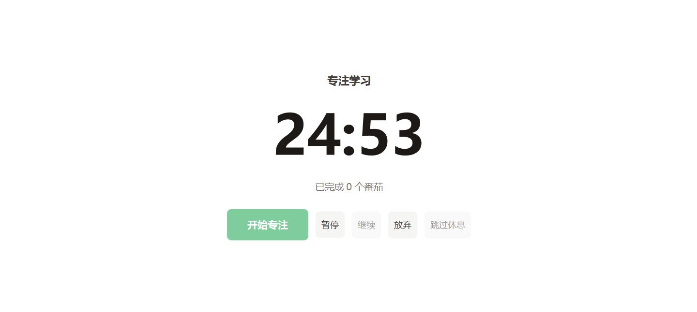
【图 3-2：正在进行的专注】

> **关于计时准确性**：软件采用的是根据开始时刻反推剩余时间的方式，而不是简单地每秒减一。这样即使系统繁忙导致刷新延迟，或者你把窗口最小化去做别的事情，计时依然准确。你可以放心地把窗口缩到托盘里学习，回来时剩余时间不会多也不会少。

## 3.3 暂停与继续

专注过程中如果临时需要处理事情，可以点击"暂停"。

暂停期间，剩余时间停止递减，这段时间**不会**计入专注时长。比如你专注于 10 分钟时暂停了 5 分钟再继续，最终这轮专注记录的仍然是完整的专注时间，不含那 5 分钟。

点击"继续"恢复计时。

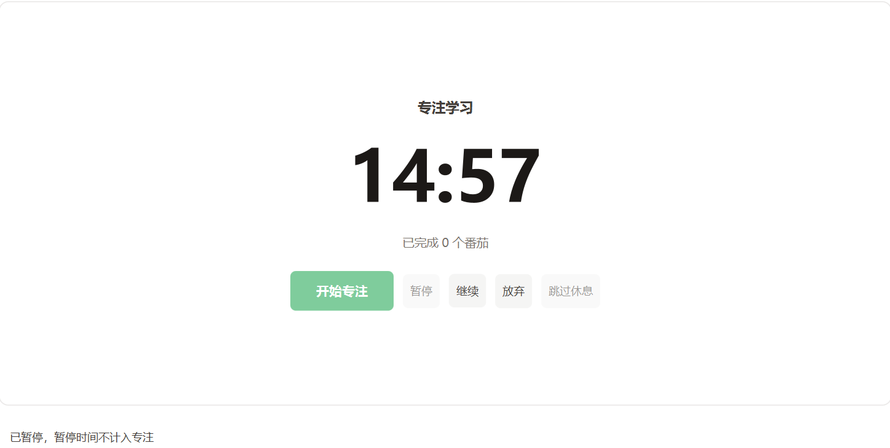
【图 3-3：暂停状态下的界面】

## 3.4 中途放弃

如果这轮专注实在进行不下去，可以点击"放弃"。

放弃后，这轮专注按**实际已专注分钟数打三折**结算能量。例如实际专注了 10 分钟，放弃后获得 3 点能量。同时，连续专注的加成会归零，从头开始计算。

之所以放弃也给一部分能量，是考虑到有些时候确实会被突发事情打断，全部作废会打击积极性。但折扣打得比较狠，是为了保证"完整做完一轮"始终是更划算的选择。

## 3.5 一轮专注结束后

专注时长走完，软件会记录这次会话并结算能量，然后自动进入休息。

结算规则见第 4 章。此刻：

- 如果这轮专注绑定了待办任务，该任务的番茄进度会自动加一
- 植物园会收到这笔能量，用于作物生长
- 统计页的数据同步更新
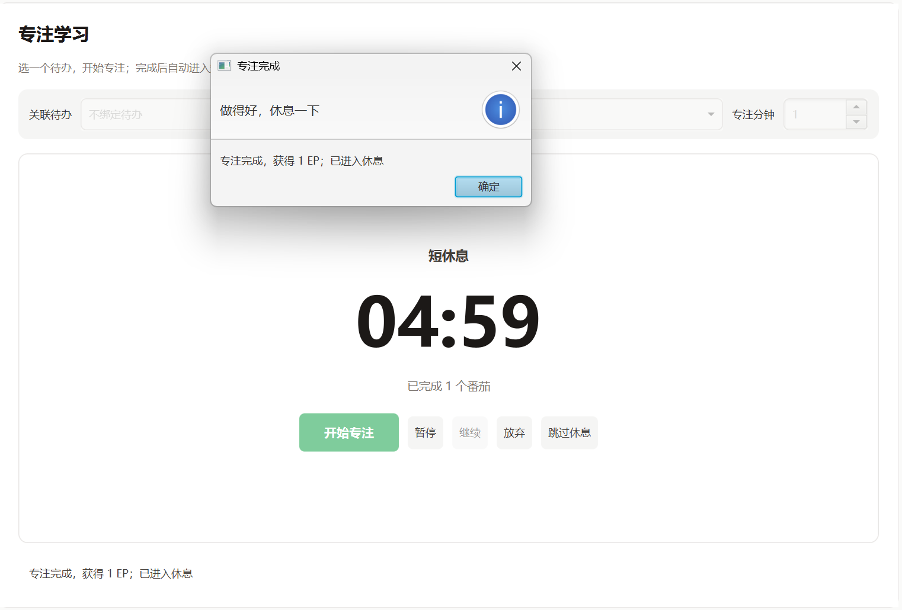
【图 3-4：专注完成后的提示】

## 3.6 番茄循环：短休与长休

休息分为两种：

- **短休**：默认 5 分钟，可设置范围 1 到 60 分钟
- **长休**：默认 15 分钟，可设置范围 1 到 120 分钟

规则是每完成四个专注，进入一次长休；其余情况进入短休。也就是说，第 1、2、3 个专注之后是短休，第 4 个之后是长休，然后重新开始计数。

这个四比一的节奏来自番茄工作法的经典设定。短休用来起身活动、喝水、看看远处，长休则可以处理一些稍长的事务。

休息时间本身不产生能量。

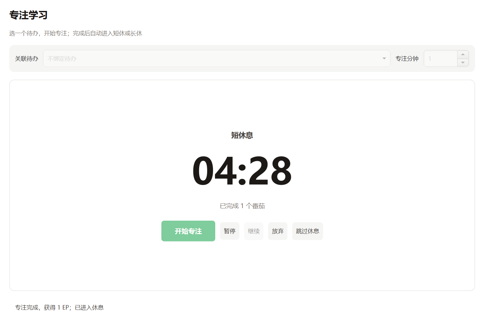
【图 3-5：休息中的界面】

## 3.7 跳过休息

如果当下不需要休息，可以直接开始下一个专注。

在休息状态下，点击"跳过休息"即可结束当前休息，回到准备专注的状态。跳过的休息不会产生任何记录，也不影响番茄计数。

## 3.8 调整默认时长

专注、短休、长休的默认时长可以在"系统与设置"页面统一调整，具体操作见第 8 章。

需要注意的是，时长设置对**下一次**计时生效。如果当前正在专注中，改动不会影响正在进行的那一轮。

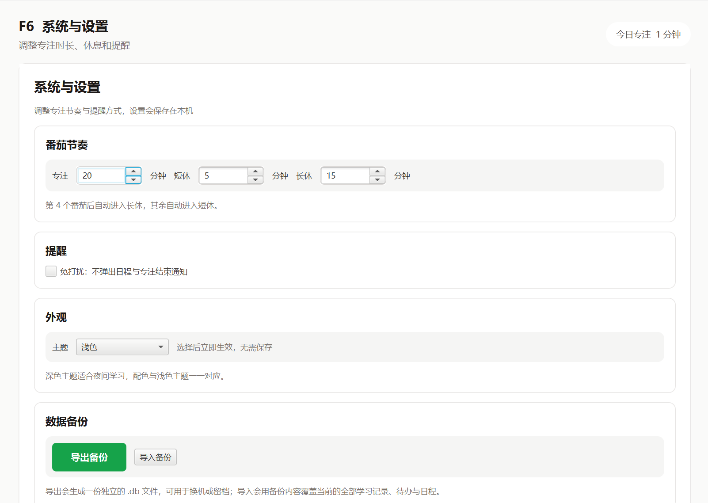
【图 3-6：时长设置界面】
---

# 第 4 章　植物园养成

植物园是这款软件和普通番茄钟最大的差别所在。专注产生的能量在这里变成看得见的生长过程。

## 4.1 能量从哪里来

每完成一轮专注，就会产生一定数量的能量。这笔能量同时流向两个地方：

**一是总能量**。总能量是你在软件里的"余额"，用来解锁新作物和支付种植消耗。这个数字在植物园页面顶部的能量条里显示。

**二是作物本身**。当前正在生长的那一株作物会获得同样的能量，累积起来推动它进入下一个生长阶段。

两边是并行的，不会互相扣减。也就是说，一株作物长大的过程，同时也是你攒下解锁资本的过程。

需要说明的是，自动浇灌的对象是**第一个生长中的地块**。如果你同时种了多株，能量会优先灌给排在前面的那一株，等它成熟收获、地块空出来，能量才会流向下一株。所以想均衡培养几株，可以等一株收完再种下一株。

休息时间不产生能量。

## 4.2 能量换算规则

单次专注获得的能量，按下面的公式计算：

```
能量 = 专注分钟数 × 1.0 × 连击系数 × 任务加成
```

三项系数的取值如下：

| 项目 | 规则 |
| --- | --- |
| 基础值 | 每专注 1 分钟得 1 点能量 |
| 连击系数 | 第 1 个番茄 ×1.0，第 2 个 ×1.1，第 3 个 ×1.2，第 4 个及以后 ×1.3 |
| 任务加成 | 本次专注绑定了待办任务，额外 ×1.1 |

连击指的是连续完成、中途没有放弃的番茄。一旦放弃一轮，连击就会重置，下一次从头算起。注意连击系数到第 4 个就不再增长了，最多就是 1.3 倍。

**几个例子：**

| 场景 | 计算 | 结果 |
| --- | --- | --- |
| 第 1 个番茄，25 分钟，未绑定任务 | 25 × 1.0 | 25 |
| 第 3 个番茄，25 分钟，未绑定任务 | 25 × 1.2 | 30 |
| 第 1 个番茄，25 分钟，绑定了任务 | 25 × 1.0 × 1.1 | 28 |
| 第 4 个番茄，25 分钟，绑定了任务 | 25 × 1.3 × 1.1 | 36 |
| 专注 10 分钟后放弃 | 10 × 0.3 | 3 |

结果四舍五入取整。

> 可以看出，连着做完四个番茄并绑定任务，同样 25 分钟能得到 36 点能量，比第一个番茄的 25 点多了四成。把任务和专注绑起来，并尽量不中途放弃，是攒能量最快的路径。

## 4.3 作物图鉴与解锁

软件内置八种作物，分三个稀有度档次。植物园页面右侧的"作物图鉴"面板列出了全部作物。

| 作物 | 稀有度 | 解锁所需能量 | 生长系数 |
| --- | --- | --- | --- |
| 向日葵 | 普通 | 无需解锁 | 1.0 |
| 番茄 | 普通 | 无需解锁 | 1.0 |
| 仙人掌 | 普通 | 无需解锁 | 1.0 |
| 郁金香 | 普通 | 无需解锁 | 1.0 |
| 玫瑰 | 普通 | 无需解锁 | 1.0 |
| 百合 | 稀有 | 300 | 1.5 |
| 兰花 | 稀有 | 600 | 1.5 |
| 樱花 | 史诗 | 1000 | 2.0 |

五种普通作物一开始就可以种，不需要任何条件。另外三种需要用总能量兑换解锁。

解锁的操作是：在图鉴里点选一株作物，然后点击"解锁选中作物"。解锁会**扣除**对应数量的总能量。比如解锁百合需要 300 点总能量，成功后这 300 点就被消耗掉了。

解锁是一次性的，解锁之后永久有效，以后想种多少次都可以，不需要重复解锁。

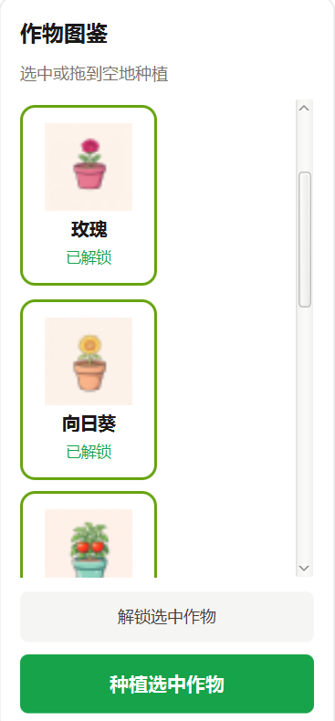

【图 4-1：作物图鉴面板】

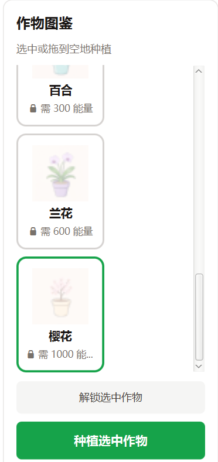

【图 4-2：解锁一株稀有作物】

## 4.4 种植

种植有两种操作方式：

**方式一**：在图鉴里点选一株已解锁的作物，再点击"种植选中作物"，系统会把它种到第一个空地块。

**方式二**：直接从图鉴里把作物**拖动**到"我的花园"里的任意空地块上。


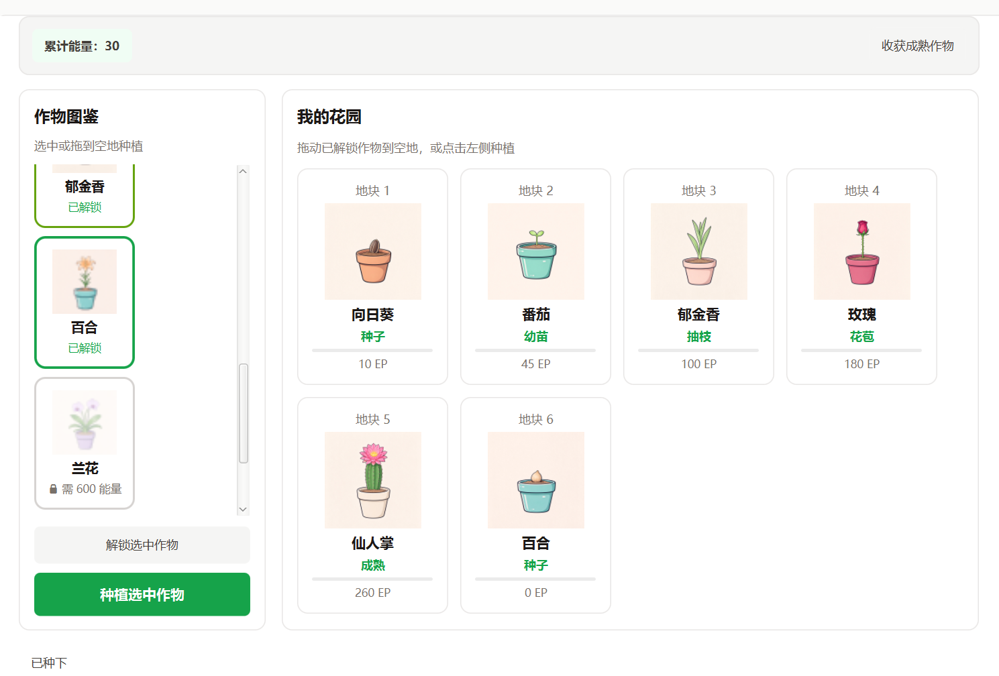
【图 4-3：拖动作物到空地块】

种植会从总能量里扣除一笔消耗：

| 稀有度 | 种植消耗 |
| --- | --- |
| 普通 | 10 |
| 稀有 | 20 |
| 史诗 | 30 |

如果总能量不够，或者目标地块已经种了作物，种植会失败并给出提示。

花园里有六个地块。地块被占用之后，要等作物收获才会空出来——软件不允许覆盖已经种下的作物。

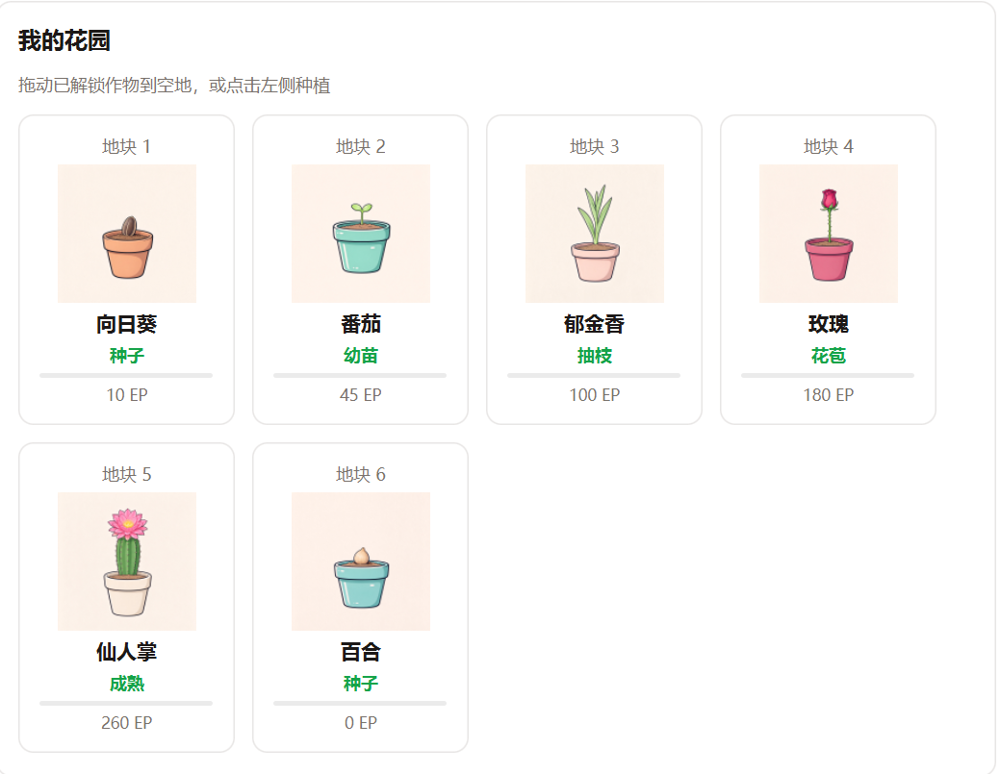

【图 4-4：种下作物的地块】

## 4.5 五个生长阶段

作物从种下到成熟，要经过五个阶段：

| 阶段 | 名称 | 普通作物所需能量 | 稀有作物 | 史诗作物 |
| --- | --- | --- | --- | --- |
| 0 | 种子 | 0 | 0 | 0 |
| 1 | 幼苗 | 30 | 45 | 60 |
| 2 | 抽枝 | 80 | 120 | 160 |
| 3 | 花苞 | 150 | 225 | 300 |
| 4 | 成熟 | 240 | 360 | 480 |

同一阶段在不同稀有度下需要的能量不同，倍数就是上表中的"生长系数"——稀有作物是普通的一点五倍，史诗作物是两倍。

这也解释了为什么稀有作物看起来"长得慢"：同样的专注时长，种普通作物已经开花了，稀有作物可能还在抽枝。作为补偿，稀有作物收获后计入图鉴的价值更高。

每次作物的阶段提升时，地块上会播放一段生长动画。

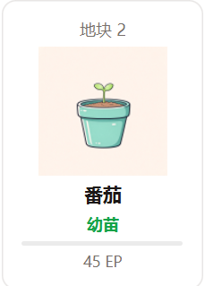

【图 4-5：幼苗阶段】

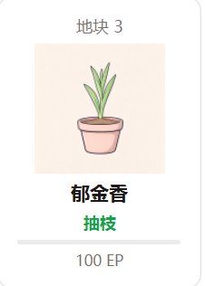

【图 4-6：抽枝阶段】

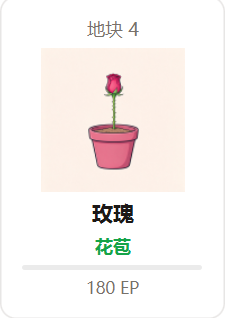

【图 4-7：花苞阶段】

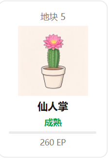

【图 4-8：成熟阶段】

地块上会显示作物名称、当前阶段和已积累的能量，还有一个进度条表示距离下一阶段还有多远。

## 4.6 收获与收集

作物到达成熟阶段后，点击"收获成熟作物"即可收取。

收获会产生两个结果：

1. 该物种在图鉴中被标记为**已收集**。这个标记是永久的，之后即使重新种植，收集记录也不会丢失。
2. 地块被清空，重新变成可种植状态。

收获**不返还**任何能量。你之前投入在它身上的能量，换来的是图鉴里的一个收集记录。

数据统计页面会显示收集进度，形如"3/8"，表示八种作物中已收集了三种。

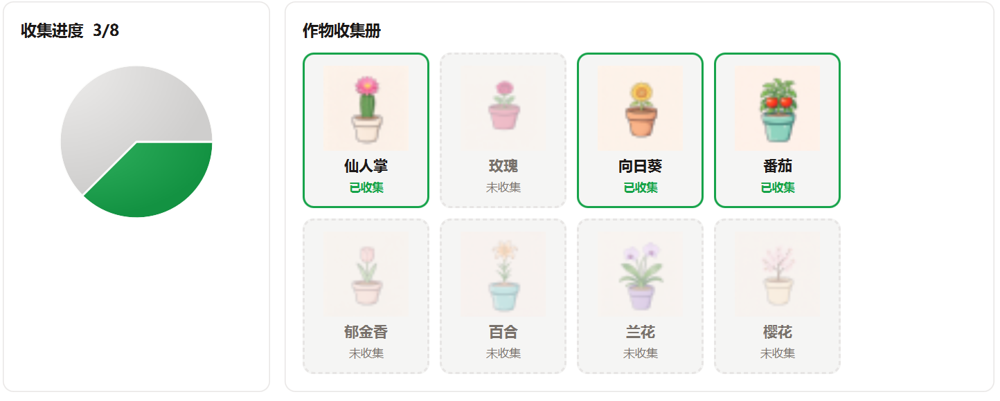

【图 4-9：收获后的提示】

## 4.7 几种常见情况

**种下之后一直没有能量进来？**

能量只在完成专注时产生。如果只是种下作物而不去专注，它不会自己长大。

**能量不够解锁稀有作物？**

先种普通作物积累。普通作物每次成熟需要 240 点能量，大约十轮满分专注就能收获一株。收获不影响总能量，所以攒够 300 点解锁百合是完全可行的。

**地块全满了怎么办？**

先收获已经成熟的作物，空出地块。如果六块都还是生长中的状态，只能等它们陆续成熟。

**种下去的作物能移除吗？**

不能。种植是不可逆的，只能通过收获来清空地块。所以种植前想清楚要种哪一株。

---

# 第 5 章　待办清单

待办清单用来记录你要完成的学习任务，并且能和专注计时打通——这是把"计划"和"执行"连起来的一环。

## 5.1 新建任务

进入待办清单页面，顶部是输入区，下方是任务列表。

新建一个任务：

1. 在输入框里填写任务名称。
2. 选择优先级（高、中、低），默认是"中"。
3. 选择截止日期。这一项可以留空。
4. 设置预计番茄数，默认 1 个，范围 1 到 20。
5. 点击"添加任务"。

任务会立刻出现在下方列表中。任务名称不能为空，输入框最多允许 200 个字。

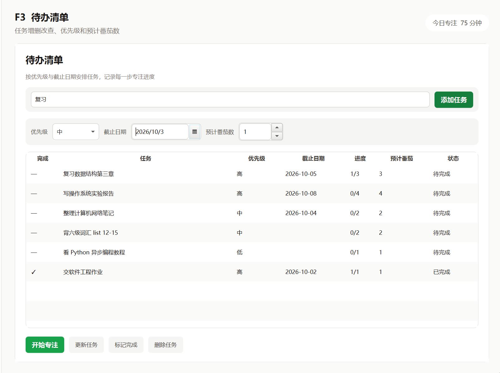

【图 5-1：新建任务】

## 5.2 列表的排列顺序

任务列表不是按创建时间排的，而是按下面的规则自动排序：

1. 未完成的任务排在已完成的任务前面；
2. 未完成的任务之间，优先级高的排前面；
3. 优先级相同时，截止日期近的排前面，没有填截止日期的排最后；
4. 以上都相同时，按添加顺序排列。

这样排列的好处是，打开页面第一眼看到的就是最该做的事。

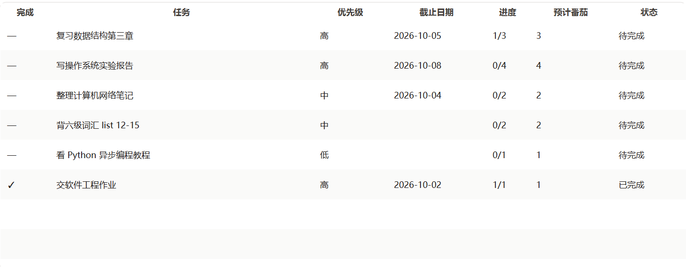

【图 5-2：任务列表】

## 5.3 任务列表的每一列

| 列名 | 含义 |
| --- | --- |
| 完成 | 已完成的任务显示对勾 |
| 任务 | 任务名称 |
| 优先级 | 高 / 中 / 低 |
| 截止日期 | 没有设置时显示为空 |
| 进度 | 已完成番茄数 / 预计番茄数 |
| 预计番茄 | 计划投入的番茄数量 |
| 状态 | 待完成 / 已完成 |

## 5.4 从待办直接开始专注

这是待办清单最有用的一个功能。

在列表里点选一个**未完成**的任务，然后点击"开始专注"。软件会自动跳到专注页面，并且把刚才选中的任务预先填进任务下拉框里。

此时直接点"开始专注"，这一轮专注就和该任务绑定了。绑定的好处有两个：

- 这轮专注获得的任务加成，能量乘以 1.1；
- 专注完成后，该任务的番茄进度自动加一。

如果选中的是已完成的任务，点击"开始专注"会提示"请先选中未完成的任务"。

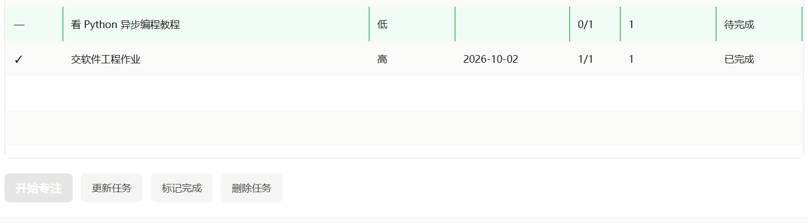

【图 5-3：从待办跳转到专注】

## 5.5 进度自动记录

任务列表里的"进度"列，显示的是"已完成番茄数 / 预计番茄数"。

每完成一轮绑定该任务的专注，已完成数就加一。这个记录不需要你手动维护。

当已完成番茄数达到预计番茄数时，任务会**自动标记为完成**，状态列变为"已完成"。比如一个预计 2 个番茄的任务，做完两轮专注后会自动完成，不用再手动去点。

## 5.6 手动标记完成

如果任务提前做完了，可以手动标记。

在列表里选中任务，点击"标记完成"，状态列立刻变为"已完成"，同时记录完成时间。已完成的任务会沉到列表底部。

## 5.7 修改与删除任务

**修改**：在列表里点选一个任务，上方输入区会自动填入它的当前信息。改动之后点击"更新任务"保存。如果任务已经完成，更新时会保留完成状态。

**删除**：选中任务后点击"删除任务"。删除前会弹出确认框，确认后任务被移除。

值得一提的是，删除任务**不会**连带删除已经产生的专注记录。之前绑定这个任务做过的专注，会话记录仍然完整保留在统计数据里，只是不再关联到具体任务。所以不用担心删任务会把历史数据弄丢。

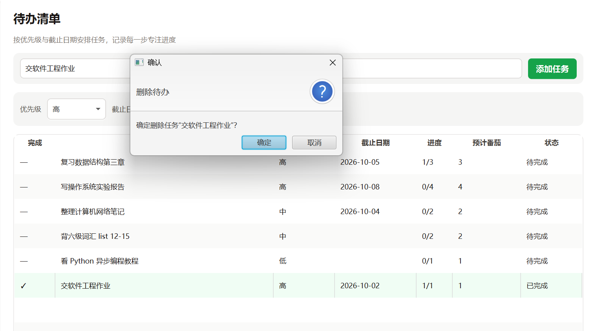

【图 5-4：删除确认框】

---

# 第 6 章　日程规划

日程规划用周视图来安排时间段。和待办清单的区别是：待办关心"要做什么"，日程关心"什么时候做"。

## 6.1 周视图

页面主体是一张时间表：横向是周一到周日七天，纵向是零点到二十三点，一共二十四行。

表格里每个格子代表某一天的一个小时。有日程的格子会显示日程标题，鼠标悬停在上面可以看到具体的起止时间。

页面顶部的"‹ 上周"和"下周 ›"按钮用来切换查看的周次。

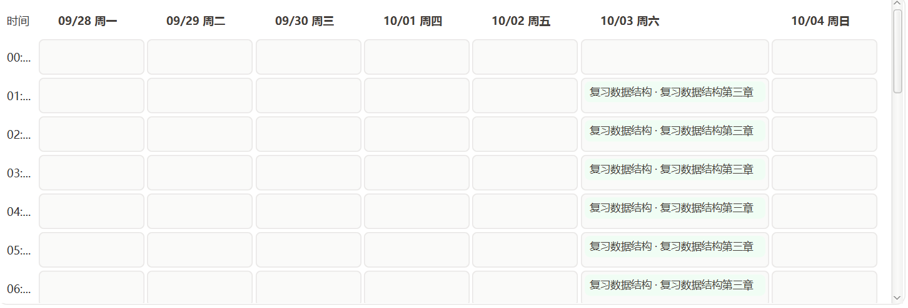

【图 6-1：周视图】

## 6.2 新建日程

1. 在表单里填写日程名称。
2. 选择日期。
3. 选择开始时间和结束时间（按整点选择）。
4. 选择类型：学习、待办或专注。类型只影响日程在表格里显示的颜色。
5. 设置重复规则，见 6.4 节。
6. 设置提前提醒的分钟数，默认 5 分钟。
7. 选择要关联的待办任务，可以不选。
8. 点击"添加日程"。

日程会立刻出现在周视图的对应位置。

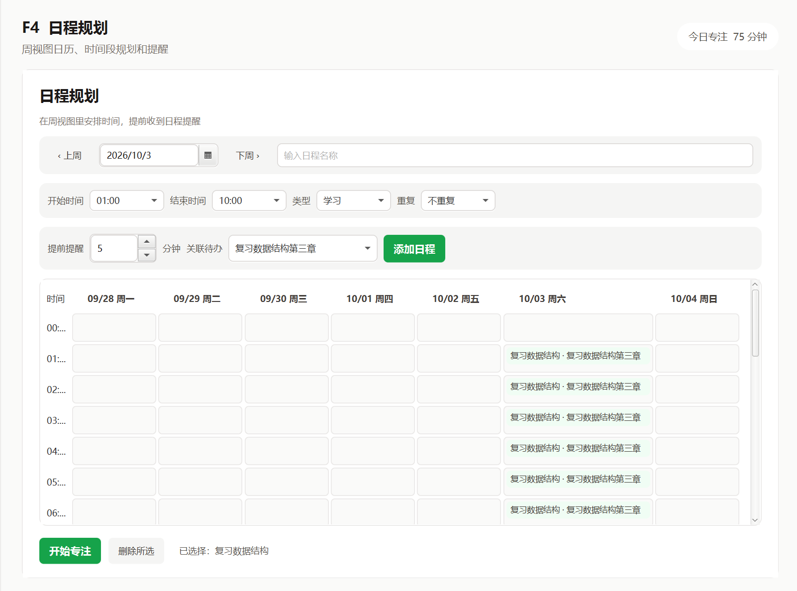

【图 6-2：新建日程】

## 6.3 关联待办

在"关联待办"下拉框里选择一个待办任务，这条日程就和它绑定了。

绑定之后有两个作用：日程在表格里显示时会带上关联任务的名称；点选这条日程再点击"开始专注"，会带着这个任务跳到专注页面。

下拉框里只列出**未完成**的任务。已经完成的任务不会出现。

## 6.4 重复规则

重复有三种选择：

- **不重复**——只在指定日期出现一次。
- **每天**——从指定日期起，之后每一天的同一时段都会出现。
- **每周**——从指定日期起，之后每一周的同一星期几都会出现。

需要说明的是，设置重复之后，数据库里仍然只有**一条**记录。重复是在显示的时候动态展开的，不是预先复制成很多条。这样做的好处是：修改或删除时只操作一条记录即可，不会出现"改了一次却只改掉一天"的情况。

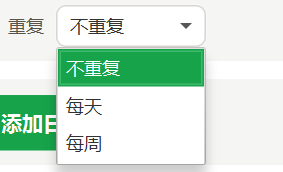

【图 6-3：设置每天重复】

## 6.5 到点提醒

软件会在后台定期检查所有日程。当当前时间进入某条日程的提醒窗口时，会弹出一个提醒对话框，显示日程名称和计划开始时间。

提醒对话框上有两个按钮：点击"前往专注"会跳到专注页面并带入关联任务；点击"取消"则关闭提示。

提醒窗口的大小由"提前提醒"的分钟数决定。比如设为 5 分钟，那么在日程开始前 5 分钟就会弹出提醒。这一项可以设置 0 到 120 分钟。

如果主窗口已经最小化到托盘，除了弹窗之外还会同时发一条托盘气泡通知，避免你漏看。

提醒检查是独立运行的，不依赖你停留在哪个页面。即使你正在专注页面计时，到点的日程提醒一样会弹出来。


【图 6-4：日程提醒弹窗】

## 6.6 跨天日程

如果结束时间不晚于开始时间，软件会判定这是一条跨天日程，自动把结束时间顺延一天。

比如设置 23:00 开始、01:00 结束，软件按次日 01:00 处理，时长两小时。所以安排晚间学习到深夜的时段是不需要额外操作的。

## 6.7 切换周次与删除

用"‹ 上周"和"下周 ›"可以前后翻看。切换周次时数据会重新加载，你之前添加的日程在任何一周都能查到。

删除日程：先在周视图里点选要删除的日程（点击格子里的日程标题），然后点击"删除所选"。删除同样会弹出确认。

如果某条日程设置了重复规则，删除它会同时移除该重复规则下所有日期的显示。


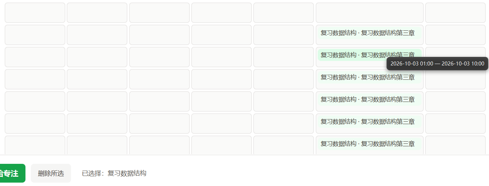
【图 6-5：选中一条日程】
---

# 第 7 章　数据统计

数据统计页面把一段时间以来的学习情况汇总起来，用图表呈现。

## 7.1 概览指标

页面顶部有四个指标卡片：

| 指标 | 含义 |
| --- | --- |
| 累计番茄 | 所有已完成专注的轮数之和 |
| 学习时长 | 所有已完成专注的分钟数之和 |
| 作物收集 | 已收集作物数 / 作物总数，形如 3/8 |
| 连续打卡 | 当前连续有专注记录的天数 |

需要注意，这里统计的只是**已完成**的专注。中途放弃的会话、以及所有休息时段，都不计入。

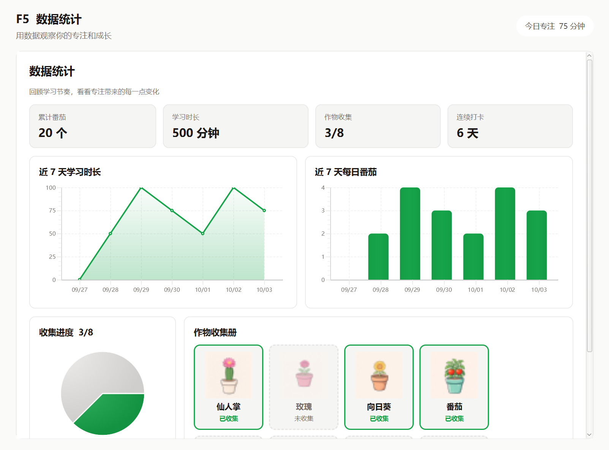

【图 7-1：概览指标】

## 7.2 专注时长趋势

第一张图是近七天的每日专注时长折线图。横轴是日期，纵轴是当天累计的专注分钟数。

从这条线上能比较直观地看出自己哪几天状态好、哪几天基本没学。如果某天没有记录，对应的点为零。

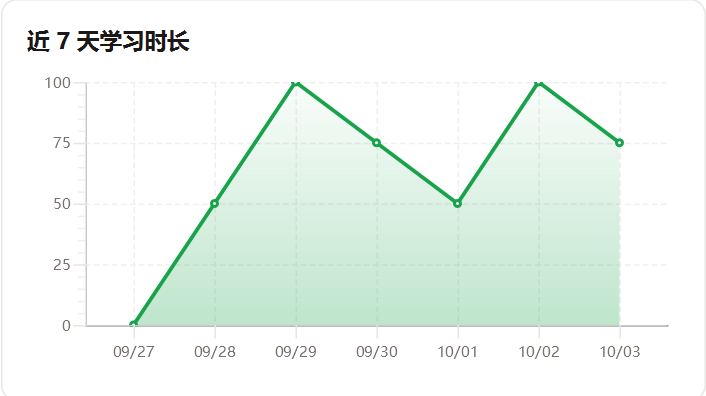

【图 7-2：专注时长趋势】

## 7.3 每日番茄数

第二张图是近七天的每日番茄数柱状图。和折线图配合看，可以区分"学习时间长"和"专注轮次多"这两种不同的状态——同样是两小时，分成四个番茄和一个超长专注，在两张图上会呈现不同的形状。

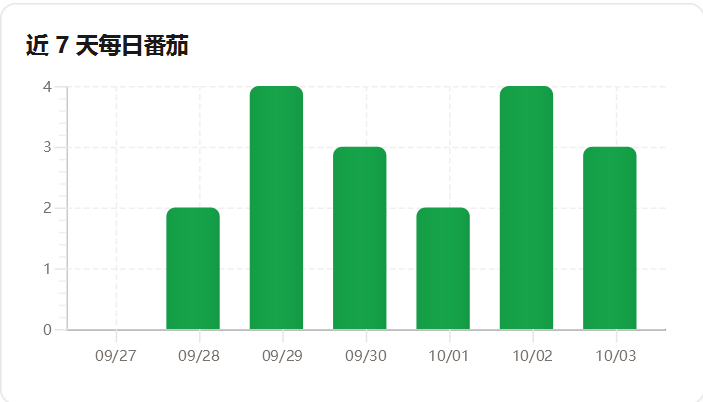

【图 7-3：每日番茄数】

## 7.4 作物收集进度

右侧的收集册以网格形式列出全部八种作物，已经收获过的显示为已收集，其余显示为未收集。

上方还有一个环形图，直观显示收集比例。

从收集册里能一眼看出还缺哪几种作物，以及它们分别需要多少能量解锁。

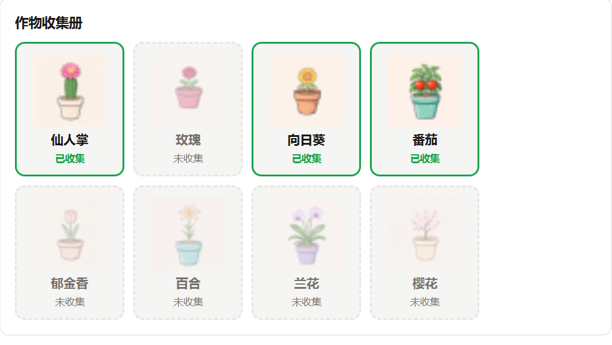

【图 7-4：作物收集册】

## 7.5 连续打卡

连续打卡天数的计算方式是：从今天往前数，连续多少天有已完成专注的记录。

只要某一天完成过至少一轮专注，这一天就算打卡。如果中间断开一天，计数归零，从下一次专注重新开始。

这个数字适合用来观察自己的持续性。比"总共学了多少小时"更能反映习惯是否稳定。

---

# 第 8 章　系统与设置

设置页面分四块：番茄节奏、提醒、外观、数据备份。

## 8.1 番茄节奏

用来调整三段计时的默认长度：

| 项目 | 默认值 | 可设置范围 |
| --- | --- | --- |
| 专注 | 25 分钟 | 1 ~ 180 分钟 |
| 短休 | 5 分钟 | 1 ~ 60 分钟 |
| 长休 | 15 分钟 | 1 ~ 120 分钟 |

改完之后点击"保存设置"。新的时长对**下一次**计时生效，正在进行的那一轮不受影响。

状态栏会提示"设置已保存；时长对下一次计时生效"。


【图 8-1：番茄节奏设置】

## 8.2 免打扰

勾选"免打扰：不弹出日程与专注结束通知"后，软件不再弹出任何提醒窗口和托盘气泡。

适合在需要长时间连续工作、不希望被打断的场景下开启。关闭免打扰后提醒恢复正常。

需要注意的是，免打扰只影响**提醒的弹出**，不影响数据的记录。日程照样会存在，专注记录照样会写入数据库，只是不弹窗提示而已。

## 8.3 外观主题

软件提供浅色和深色两套主题，在"主题"下拉框里切换。

选中之后**立刻生效**，不需要点保存。切换主题时正在进行的计时不会中断，各个页面的布局也不会变化——两套主题共用同一套界面结构，只是配色不同。

深色主题适合夜间使用。它不只把背景变暗，文字、边框、图表的配色都做了对应调整，不是简单地把浅色反相。


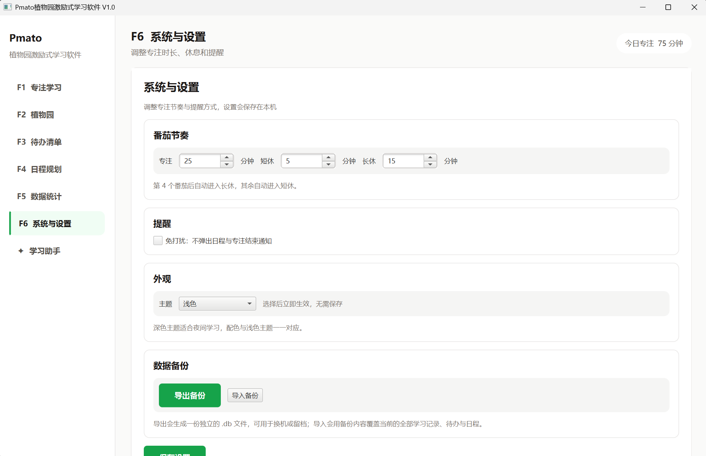
【图 8-2：浅色主题】
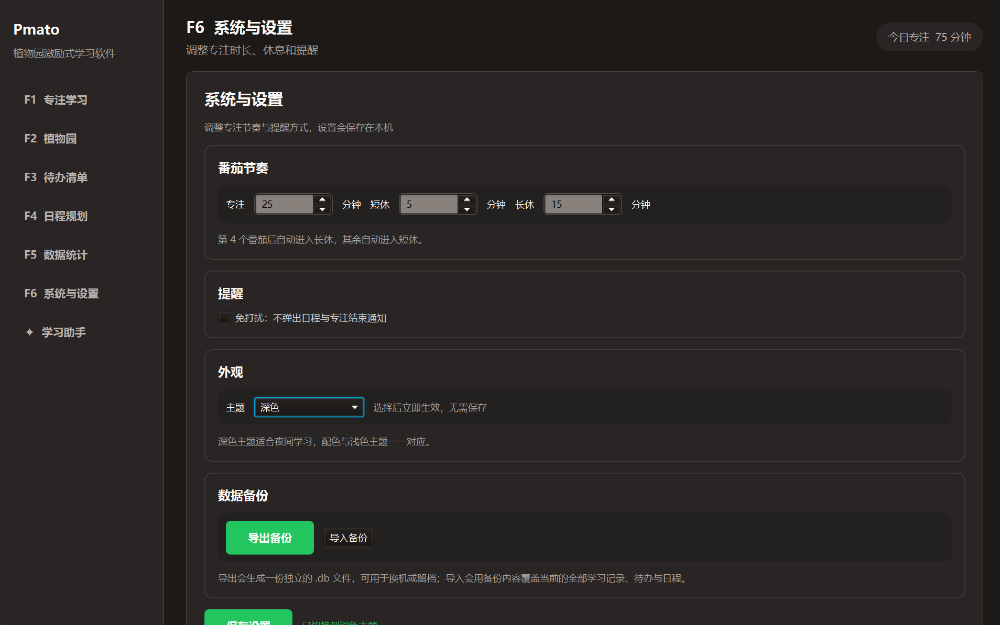
【图 8-3：深色主题】

## 8.4 数据备份与恢复

这一块提供两个按钮，用来导出和导入数据库文件。

**导出备份**

点击"导出备份"，会弹出文件保存对话框，默认文件名形如 `pmato-backup-20261001-143000.db`，带日期和时间，方便区分不同时间点的备份。

选择保存位置后确认即可。导出的文件是一个完整的数据库副本，包含你的全部专注记录、待办、日程和植物园状态。

导出过程**不需要退出软件**，计时和提醒都能继续正常运行。

**导入备份**

点击"导入备份"，选择之前导出的 `.db` 文件。

因为导入会用备份中的数据**覆盖当前全部内容**，所以软件会先弹出确认框：

> 导入会用备份中的数据覆盖当前全部学习记录、待办与日程，且无法撤销。确定继续吗？

确认后开始导入。导入完成的瞬间，界面会自动刷新，显示备份中的数据。

导入前软件会先检查所选文件是不是有效的数据库文件。如果误选了图片或文档，会提示"这不是有效的备份文件"并中止，不会破坏你现有的数据。

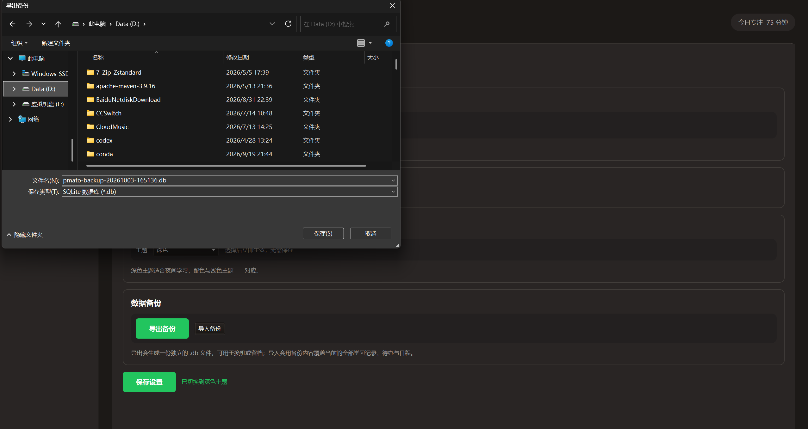
【图 8-4：导出备份】

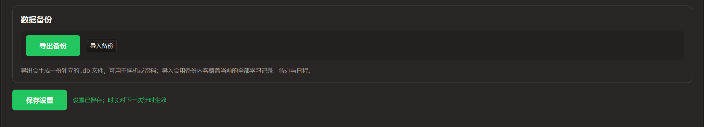
【图 8-5：导入确认框】

> **建议**：在更换电脑、重装系统之前，先导出一份备份。数据库文件位于程序运行目录下，名为 `mengya.db`，直接复制这个文件同样可以达到备份效果。

---

# 附录　学习助手

学习助手是软件内置的一个人工智能辅助功能，可以帮你把大任务拆成小步骤，或者规划一段时间的学习安排。

## 附 1　使用前的准备

学习助手需要调用外部的 OpenAI 接口，因此需要你自己准备一个 API Key。

在页面顶部的"API Key"输入框里填入你的密钥。输入框是密码形式，内容以圆点显示。

密钥**只保留在本次页面内，不会写入数据库或任何配置文件**。也就是说，关掉软件之后需要重新输入。

另一种方式是在启动软件之前设置环境变量 `OPENAI_API_KEY`，这样就不需要每次输入。

## 附 2　三种用法

页面上有三个按钮，分别对应三种用途：

**拆解待办**

把一个大任务拆成可以立刻开始的小步骤。适合面对"写一篇论文""复习整本书"这类模糊的大目标时使用——先让它帮你拆出第一步做什么。

**规划本周**

为接下来一周安排学习节奏。它会结合你已有的待办和日程给出建议。

**发送问题**

直接提问。在输入框里描述你的情况，例如"我有两天时间准备高数测验，请帮我安排复习顺序"，然后点击"发送问题"。

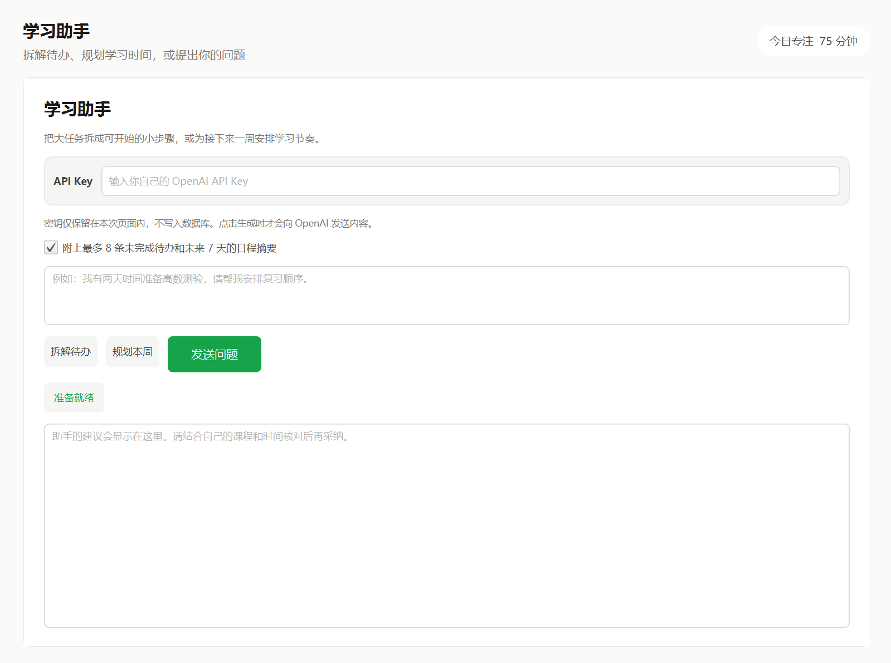

【图 附-1：学习助手页面】

## 附 3　关于数据发送

页面上有一个复选框："附上最多 8 条未完成待办和未来 7 天的日程摘要"。

勾选之后，在点击生成按钮的那一刻，软件会把最多 8 条未完成的待办、以及未来 7 天的日程摘要，随你的问题一起发送给 OpenAI，让建议更贴合你的实际情况。

不勾选则只发送你在输入框里写的内容。

**无论是否勾选，密钥都不会写入数据库或配置文件，也不会随请求之外的操作发送。**

## 附 4　几点说明

**建议仅供参考。** 助手给出的安排是建议，需要结合你自己的课程表和实际时间核对后再采纳。软件不会根据助手的输出自动修改你的待办、日程或计时记录。

**需要联网。** 这个功能依赖网络，离线状态下无法使用。软件的其余全部功能都不需要联网。

**可能产生费用。** 调用 OpenAI 接口可能产生账户费用，具体计费方式以服务提供方为准。

**输出需要时间。** 点击生成后，状态栏会显示"正在生成建议…"，下方文本区会清空等待结果。生成期间界面不会卡死，可以正常切换页面。

---

## 手册说明

- 软件名称：Pmato植物园激励式学习软件
- 版本号：V1.0
- 运行平台：Windows 10 / Windows 11
- 手册编写日期：2026 年 10 月 1 日
